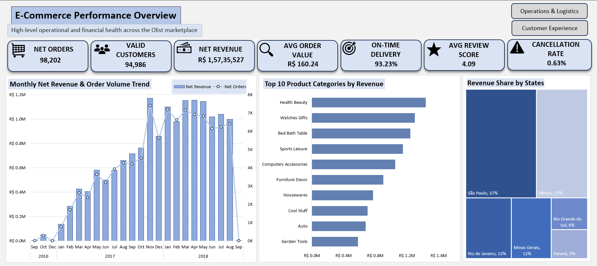
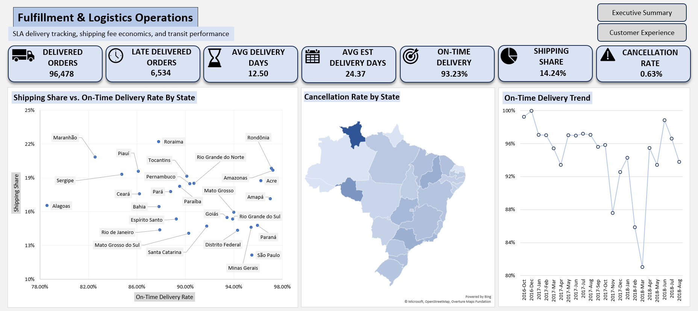
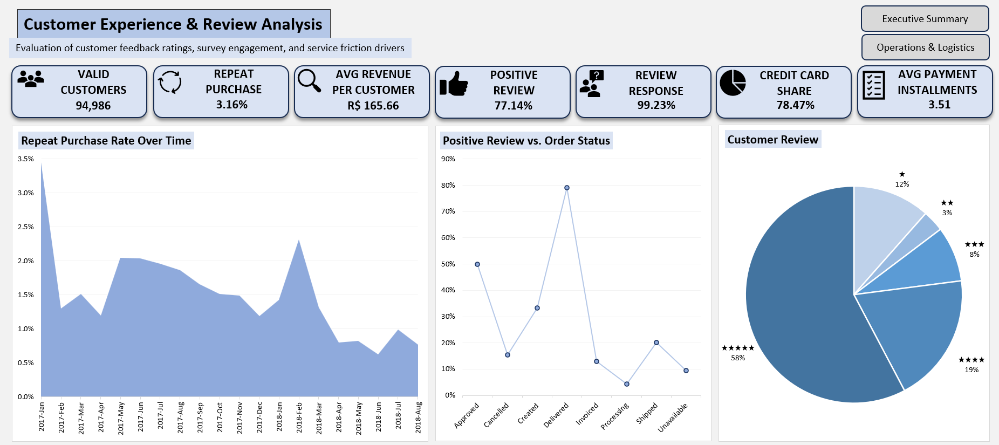

# 📊 Olist E-Commerce Analytics

> An end-to-end **Excel-only e-commerce analytics project** built using the
> Brazilian E-Commerce Public Dataset by Olist.

This project analyzes the operational, financial, and customer-experience
performance of an e-commerce marketplace and identifies patterns that could
support better business decisions and areas for further investigation.

---

## 🎯 Project Objective

The main objective was to analyze an e-commerce marketplace from multiple
business perspectives natively within **Microsoft Excel's modern BI stack (Power Query, Power Pivot, and DAX)**.


The analysis focuses on:

- Revenue and order performance
- Product category performance
- Geographic revenue distribution
- Delivery and fulfillment performance
- Payment behaviour
- Customer reviews
- Repeat purchasing
- Cancellation and shipping performance

---

## 📂 Dataset

**Brazilian E-Commerce Public Dataset by Olist**

📌 **Source:** [Kaggle – Brazilian E-Commerce Public Dataset by Olist](https://www.kaggle.com/datasets/olistbr/brazilian-ecommerce)

The dataset contains anonymized e-commerce data from the Olist marketplace,
covering approximately 100,000 orders between 2016 and 2018.

### 📋 Datasets Used

| Dataset | Used |
|---|:---:|
| `olist_customers_dataset.csv` | ✅ |
| `olist_order_items_dataset.csv` | ✅ |
| `olist_order_payments_dataset.csv` | ✅ |
| `olist_order_reviews_dataset.csv` | ✅ |
| `olist_orders_dataset.csv` | ✅ |
| `olist_products_dataset.csv` | ✅ |
| `olist_sellers_dataset.csv` | ✅ |
| `product_category_name_translation.csv` | ✅ |
| Geolocation dataset | ❌ |

The geolocation dataset was excluded because it did not provide sufficient
analytical value for the objectives of this project.

---

## 🛠️ Tools & Technologies


### 🔧 Excel Features Used

- **Power Query** — data cleaning and transformation
- **Power Pivot** — data modelling
- **DAX** — calculated measures and KPIs
- **PivotTables** — analytical summaries
- **PivotCharts & Excel Charts** — visualization
- **Excel Dashboarding** — interactive presentation

---

## 🧹 Data Preparation

Power Query was used to prepare the raw datasets for analysis.

### Transformations performed

- Removed timestamp information from date columns
- Changed columns to appropriate data types
- Renamed columns using a consistent naming convention
- Added full Brazilian state names for better readability
- Translated Portuguese product category names into English
- Merged and joined tables where required
- Created helper/supporting queries

---

## 🏗️ Data Model

The project uses a **⭐ Star Schema** data model built with Power Pivot.

### 🧱 Model Structure

**Dimension Tables**

- `dim_customers`
- `dim_products`
- `dim_sellers`
- `Calendar`

**Fact Tables**

- `fact_orders`
- `fact_order_items`
- `fact_payments`
- `fact_reviews`

**Measures**

- `_Measures`

The data model was designed to allow analysis across orders, customers,
products, sellers, payments, reviews, and delivery performance.

---

## 📐 Analysis & DAX

DAX measures were created to calculate the major KPIs used throughout the
dashboards.

Examples include:

- Net Revenue
- Net Orders
- Valid Customers
- Average Order Value
- On-Time Delivery Rate
- Average Review Score
- Cancellation Rate
- Repeat Purchase Rate
- Payment-related metrics

---

# 📊 Dashboards

The workbook contains **three analytical dashboards**, each focused on a
different area of the marketplace.

---

## 1️⃣ E-Commerce Performance Overview



### 📌 Focus

Provides a high-level overview of the marketplace's financial and operational
performance.

### 📊 Includes

- Net Orders
- Valid Customers
- Net Revenue
- Average Order Value
- On-Time Delivery
- Average Review Score
- Cancellation Rate
- Monthly Revenue & Order Volume
- Top 10 Product Categories by Revenue
- Revenue Share by State

---

## 2️⃣ Fulfillment & Logistics Operations



### 🚚 Focus

Analyzes delivery performance, shipping economics, and fulfillment efficiency.

### 📊 Includes

- Delivered Orders
- Late Delivered Orders
- Average Delivery Days
- Estimated Delivery Days
- On-Time Delivery Rate
- Shipping Share
- Cancellation Rate by State
- Shipping Share vs. On-Time Delivery
- On-Time Delivery Trend

---

## 3️⃣ Customer Experience & Review Analysis



### ⭐ Focus

Analyzes customer feedback, repeat purchasing, and payment behaviour.

### 📊 Includes

- Valid Customers
- Repeat Purchase Rate
- Average Revenue per Customer
- Positive Review Rate
- Review Response Rate
- Credit Card Share
- Average Payment Installments
- Repeat Purchase Rate Over Time
- Positive Reviews vs. Order Status
- Customer Review Distribution

---

## 🔎 Key Findings

### 💰 Revenue Concentration

São Paulo generates a significant share of the marketplace's revenue,
representing approximately **37.4%**.

### 🚚 Delivery Performance

Periods of higher order volume, particularly around **November 2017 and
March 2018**, coincided with declines in on-time delivery performance.

### 🌎 Regional Logistics

Several northern states show relatively high shipping shares while also
having lower on-time delivery rates compared with many other states.

### ⚠️ Cancellation Rate

The overall cancellation rate is approximately **0.63%**, while Roraima
shows a higher cancellation rate of approximately **2.17%**.

---

## ⚠️ Data Limitations

The dataset provides useful transactional and operational information, but it
does not contain enough detail to answer every type of business question.

Important limitations include:

- No detailed customer demographic information
- Limited product attributes
- No product cost or margin information
- No marketing or customer-acquisition information
- Limited information for explaining the underlying reasons behind repeat
  purchasing or customer churn

Because of these limitations, the analysis focuses on patterns that can be
reasonably supported by the available data.

---

## 📂 Project Workflow
```
Raw Olist Data
      ↓
Power Query
      ↓
Data Cleaning & Transformation
      ↓
Power Pivot Data Model
      ↓
DAX Measures
      ↓
PivotTables / PivotCharts /Charts
      ↓
Visualization
      ↓
Interactive Excel Dashboards
```